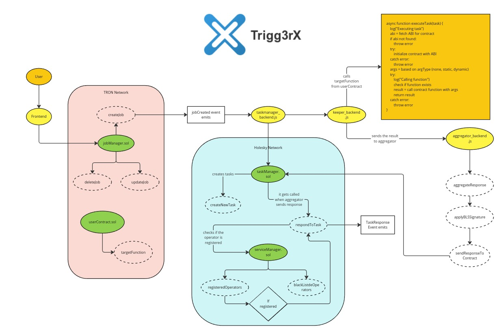

# Trigg3rX


## Ticks time, Triggers tasks, and Turbocharges TRON

Trigg3rX is a cross-chain automation platform designed to automate on-chain tasks such as staking, token swaps, and liquidations within the TRON ecosystem. It leverages Ethereum's EigenLayer Automated Validation System (AVS) for decentralized task execution, bringing the benefits of Ethereum-like automation to the TRON blockchain.

---

## What it Does

Trigg3rX allows users to automate time-sensitive or condition-based tasks on the TRON blockchain. Some key features include:

- **Time-based Automation:** Schedule tasks such as staking or token burns to occur at specific intervals.
- **Condition-based Triggers:** Automate tasks like token swaps or liquidations triggered by price changes.
- **Event-driven Execution:** Trigger actions based on on-chain events like token transfers or liquidity thresholds.

By using decentralized keepers operating on Ethereum's AVS, tasks are executed without the need for manual oversight, ensuring a seamless and reliable automation process.

---

## How it Works

Trigg3rX utilizes cross-chain messaging between Ethereum and TRON to handle automation tasks:

- **Backend:** Implemented with Node.js, it handles secure data flow between the TRON blockchain (via TronWeb) and Ethereum (via Ethers.js).
- **Smart Contracts:**
  - On TRON, the `JobManager` contract allows users to create and manage automation tasks.
  - On Ethereum, `TaskManager` and `ServiceManager` contracts manage decentralized keeper tasks and validation.
- **Frontend:** A React-based interface enables users to define automation rules, schedule tasks, and track task progress in real-time.



---

## Getting Started

To get started with TriggerX, follow these steps:

1. **Clone the Repository:**

   ```bash
   git clone https://github.com/trigg3rX/triggerx.git
   cd triggerx
   ```

   - You can clone a specific submodule using command:

      ```bash
      git submodule update --init --recursive -- <submodule_name>
      ```

   - Or, you can clone all submodules using command:

      ```bash
      git submodule update --init --recursive
      ```

2. **Start Contracts:**
   You can follow the instructions [here](contracts/README.md) to deploy the smart contracts on TRON and Ethereum.
   We have already deployed the contracts on the testnets for you to interact with, and their addresses are:
   - [JobManager | Tron](https://nile.tronscan.org/#/contract/TEsKaf2n8aF6pta7wyG5gwukzR4NoHre59)
   - [TaskManager | Ethereum](https://holesky.etherscan.io/address/0xdaa3d01f71f638952db924c9fe4f1cda847a23ad)
   - [ServiceManager | Ethereum](https://holesky.etherscan.io/address/0x2af281f3a292543b8c80cb087e19671db534a9ee)

3. **Initialize the Backend:**
   - Detailed instructions are [here](backend/README.md)

4. **Host the Frontend:**
   - Detailed instructions are [here](frontend/README.md) to host on local.
   - You can also access the hosted version [here](https://trigg3rx.vercel.app).
   - Test Value sets for frontend Demo:

      **Value Set:** For a contract which links domain name to wallet address

      **Contract Address:** `TN4MeYmA3CRmo6Uj6h4Yj2pPcnJiwGaFog`

      **Target Function Signature:** `linkDomainToAddress(bytes32,address)`

      **Argument Type:** Static

      **Arguments:** `tronscan.nile.org,TEqqmXaynt9XmmcBNYbJh5tMVDmm183c2r`

      Notice how we wrote the targetFunctionSignature and arguments.
      - No spaces are allowed in the arguments.
      - The arguments are separated by commas.
      - The arguments types mentioned in function signature should be in the same order required by the function.
